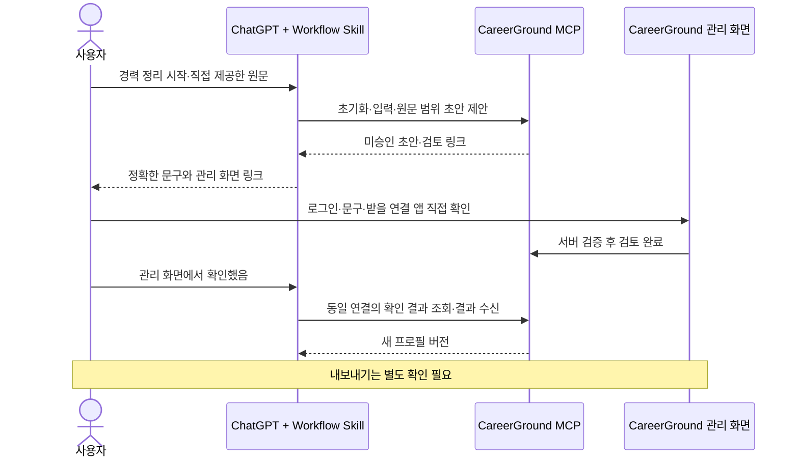

# ChatGPT 경력 대화 + CareerGround 관리 화면 실행 결과

- 기준: `codex/mvp-foundation-ci-20260923`, HEAD `671cac84bd619c384093b7a2a9e1d3a15c6c481f`.
- 2026-10-03 사용자 승인: 권장 순서 1→4 구현·시험·분석.
- 범위: 합성 자료, 기존 개인 ChatGPT 계정과 기존 private Secure MCP Tunnel, 일회용 로컬 DB.
- 실제 경력 자료, 운영 서비스, 외부 모델 API, 새 유료 자원, 공개 배포, commit/push는 사용하지 않았다.

## 1. 대화 패키지와 제품 도구

`plugins/careerground/`에 경력 대화 Workflow Skill과 portable plugin source를 추가했다.
패키지 builder는 manifest/Skill/명시적인 MCP binding만 ZIP에 넣는다. 비밀 파일이나
프로젝트 초안은 포함하지 않는다. 기본 서버 주소와 계정 credential은 없다.

| 도구 | 서버 책임 |
| --- | --- |
| `get_my_profile` | 검증된 연결의 프로필·현재 버전 및 최대 10개 진행 중 세션의 ID/경험 범위 조회. 원문·승인 증명·다른 사용자 ID 제외 |
| `initialize_career_profile` | 명시적 시작과 정책 버전 확인. trusted adapter가 허용한 verified issuer/sub만 계정·버전 0 프로필·빈 archive 초기화 |
| `propose_profiling_drafts` | 소유한 현 세션·원문·버전에서 Python Unicode 범위 1~5개를 잘라 미승인 CONTRIBUTION 초안 생성 |
| `get_confirmation_status` | 원래 요청의 계정·OAuth credential/client 연결과 일치할 때만 브라우저 확인 결과/증명 조회 |

제품 MCP는 총 30개 도구다. 제안 문구, 승인 상태, 계정 ID를 모델에서 받아 사실로 저장하지
않는다. source span은 정확한 한 줄 원문이며 atomicity는 UNVERIFIED다. 같은 원문/범위
재시도는 동일 초안으로 돌아오고 다른 범위의 추가 저장은 거절된다. 정정은 새 protocol cycle로
진행하여 이전 원문의 검토를 재사용하지 않는다.

계정 초기화는 기본적으로 새 사용자를 자동 허용하지 않는다. 실제 가입은 JWT 검증과 별도로
trusted admission adapter가 동일 opaque account ID를 유지해야 한다. 삭제된 AuthIdentity의
재등록도 남아 있는 Account tombstone과 그 ID로 차단한다. 프로필의 DELETING/ERASED 상태를
복구하거나 다시 활성화하지 않는다. 신규·기존 계정의 동시 첫 사용은 PostgreSQL에서
프로필/초기 archive가 하나만 남는지 검증했다. DB schema/migration 추가는 없다.

## 2. BrowserOS 실제 ChatGPT 시험

개인 디렉터리에 **CareerGround 합성 여정 시험**을 등록하고 앱 1개 + Skill 1개를 확인했다.
repo의 portable source와, 실제 개인 디렉터리에서 다운로드한 기존 등록 manifest를 유지한
호환 ZIP을 구분했다. 개인 시험 ZIP에는 등록된 앱 mapping과 동일 repo Skill만 넣어
단계별 버전 업로드를 수행했다. portable builder의 로컬 ZIP 검사가 개인 디렉터리의
portable manifest 직접 import 검증을 대신하는 것은 아니다.
기존 OAuth PoC와 기존 tunnel 설정을 덮어쓰지 않았다. ChatGPT Work에 표시된 모델은
**GPT-6.1 Sol / Light**였다. 서버에 직접 RPC를 보내는 단위시험과 이 실제 모델 시험은 별개다.

이 시험 adapter의 외부 인증은 NONE이며 계정은 서버가 정한 일회용 합성 신원이다. 내부 제품
MCP에는 합성 JWT/scope/소유권 검사가 적용된다. 관리 화면은 별도 browser session을 사용한다.
**실제 사용자 OAuth, SSO, 여러 실제 사용자 격리, 운영 인증 완료의 증거는 아니다.**

합성 원문은 `합성 API를 구현했습니다.` 한 줄이다. 첫 시험에서 초기화→원문 저장→
범위 `[0,15)` 미승인 초안→FACT_REVIEW WAITING 링크를 실제 모델이 준비했다.
회사명·기간·성과 수치가 생성되지 않았으며 승인 전에 멈췄다.

첫 링크 만료 후 재개 과정에서는 모델이 기존 세션 ID를 찾지 못했다. 만료 링크는 관리
화면에서 사용할 수 없었고 승인되지 않았다. 이 발견에 따라 `get_my_profile`의 진행 중
작업 메타데이터를 보완했다. ACTIVE/현재 버전/보관 기한/현재 cycle/삭제 범위를 검사하고
여러 경험이면 선택을 요청하도록 Skill을 수정했다. 이 재조회는 원문을 재수집하지 않는다.

두 번째 합성 여정에서는 관리 웹의 사실 검토 후 같은 연결에서 DONE을 조회하고
`submit_claim_review`로 결과를 수신했다. 프로필 버전 1과 원문 사실 1개를 실제 ChatGPT가
확인했다. 내보내기는 별도 WAITING 요청으로 멈췄다. 토큰 갱신 뒤 이전 승인의 조회는
NOT_FOUND로 거절됐으며 새 요청과 새 브라우저 확인 뒤 JSON export metadata
(1,154 bytes)를 수신했다. 이 실패를 성공으로 처리하지 않고 새 확인을 요구했다.

호스트가 단기 `resource_uri`를 목록에서 찾지 못해 JSON 본문을 읽지 못하는 문제도
발견했다. 이에 resources/list가 같은 credential에서 확인·수신한 CONSUMED export만
최대 10개 표시하도록 보완했다. 조회 시 보관 기한·계정/프로필/자료 삭제 상태·content hash를
검사한다. WAITING/DONE, 다른 사용자/client/token, 부족한 scope, 삭제·만료 자료는
목록에 없다. 새 도구나 외부 다운로드 서비스는 추가하지 않았다. 본문은 기존
resources/read의 동일 소유권·credential 검사를 그대로 사용한다. 그러나 재시험에서도
실제 ChatGPT 대화에서는 새 리소스 목록에서 해당 URI를 찾을 수 없다는 응답을 받았다. 목록 보완의
직접 SDK 시험 성공을 ChatGPT 본문 읽기 성공으로 기록하지 않았다.

이 호환성을 위해 기존 `export_profile_data`/`export_resume` 응답에 `content_delivery`와
`content`를 추가했다. 동일 browser receipt의 CONSUMED 결과에서 기존 read_export의
소유권·기한·삭제·lineage·hash 검사를 다시 통과한 본문만 제공한다. UTF-8 64 KiB 이하이면
INLINE, 초과하면 RESOURCE_ONLY와 content=null이며 잘린 문장을 제공하지 않는다.
추가 승인이나 새 외부 전송 경로는 없고 내보내기를 허용한 원래 연결에만 전달한다.
큰 파일의 ChatGPT 호스트 전달은 후속 호환성 범위이며 임의 URL을 만들어 해결하지 않는다.

최종 개인 시험 패키지 **1.0.4**에는 repo와 동일한 Skill을 업로드했다. 마지막 합성
여정에서 별도 브라우저 export 확인 후 실제 ChatGPT가 **INLINE JSON 본문**을 읽었다.
Claim의 exact_text와 Evidence의 exact_excerpt가 `합성 API를 구현했습니다.`와 정확히
일치한다고 대조했고 회사명·경력 기간·성과 수치가 추가되지 않았음을 확인했다.
USER_CONFIRMED/fact_reviewed=true와 사용 정책 REVIEW_REQUIRED를 구분했다.
시스템 ID·버전 같은 metadata를 경력 성과 수치로 해석하지 않았으며 승인 증명은
대화에 출력하지 않았다. 실제 ChatGPT의 기본 경력 여정과 작은 JSON 본문 수신을
확인한 것이며 대용량 파일·다양한 경험의 품질이나 실제 OAuth 완료를 의미하지 않는다.

토큰 갱신 때 오래된 내보내기 승인은 재사용하지 않았고 동일 범위의 새 요청→새 브라우저
확인으로 진행했다. 시험 adapter의 내부 access token은 5분짜리다. 장시간 검토/갱신의
사용성 및 화면의 기한 안내는 실제 OAuth 연결 acceptance에서 별도로 확인해야 한다.

## 3. 관리 화면과 승인 경계

URL은 서버 설정 `management_origin`에서만 만든다. request Host나 원문/모델 URL을 신뢰하지
않는다. 원격 관리 origin은 HTTPS를 요구하고 HTTP는 loopback만 허용한다. 성공 화면에는
원래 ChatGPT 대화로 돌아가 진행을 요청하는 안내를 추가했다. 증명을 수동 복사할 필요 없이
해당 연결에서 조회할 수 있다. 채팅의 “확인했어”만으로 승인 상태를 만들 수는 없다.

사실 확인은 사용 허용/내보내기와 별개다. PROFILE_EXPORT/RESUME_EXPORT는 범위·버전·형식과
결과를 받을 앱에 대해 별도 브라우저 확인을 요구한다. 토큰 교체, 만료, 버전 변경에는 기존
증명을 재사용하지 않는다. ChatGPT embedded UI는 현재 필수가 아니며 관리 웹을 우선 사용한다.

## 4. 서버 AI 도입 판단과 남은 작업

### 현재 판단

초기 ChatGPT 여정에는 **별도의 유료 서버 모델 API 도입을 보류**한다. 실제 호스트 모델이
대화와 source span 제안을 수행하고 CareerGround 서버가 원문·소유권·버전·승인·보관·삭제를
검증하는 구조로 기본 경력 입력을 진행할 수 있었다. 외부 모델 API는 이번 시험에 호출하지
않았다. 일반 사용자 요금제/한도/디렉터리 설치 자격이나 운영 hosting 비용을 0으로 보장하는
결론은 아니다.

| 역할 | 담당 |
| --- | --- |
| 질문, 사용자 언어의 대화, 원문 범위 제안 | ChatGPT + CareerGround Workflow Skill |
| 계정, 원문, source hash, 버전, 구조·범위 검증 | CareerGround 서버 |
| 실제 사실·문구·사용 범위·내보내기 결정 | 사용자 + 신뢰된 관리 웹 |
| 데이터 보관·삭제·복구 격리·운영 상태 | CareerGround 서버와 승인된 운영 adapter |

다음 조건이 실제 요구로 확정될 때 서버 AI를 다시 평가한다.

1. ChatGPT 없이 독립 웹에서 AI 대화가 필요함.
2. 사용자가 대화를 떠난 뒤에도 AI 작업을 수행해야 함.
3. 다양한 호스트 모델에서 목표 품질/원문 범위를 유지하지 못함.
4. 의미 기반 JD 분석·R2 편집을 결정적 검증과 사용자 검토만으로 만족시키지 못함.

이 경우에만 대상 작업·품질 평가·단가·예산 한도·데이터 처리 정책을 먼저 설계하고
외부 AI/유료 resource 연결은 별도 승인한다. 현재 JD mock이나 좁은 R2 검사를 의미 분석
품질 완료로 해석하지 않는다.

### 실사용 전 남은 순서

1. **실제 인증과 가입**: identity provider/admission ID 지속성, ChatGPT OAuth와 관리 browser의
   같은 계정 연결, 토큰 갱신/취소, 삭제 후 재가입 정책을 합성 외부 인증 시험으로 검증.
2. **한국어 경력 품질 평가**: 여러 경험·공동 기여·모호한 수치·정정·사용자 거절·R3 새 사실·
   긴 문장/emoji·중단 재개의 대표 합성 사례로 실제 ChatGPT 모델 시험. 단일 원문 성공을
   전체 의미 품질 승인으로 확대하지 않음.
3. **운영 gate**: hosting/DB/object storage, retention worker, 실제 provider erasure receipt,
   backup/restore quarantine, 재인증·모니터링·지원 절차와 비용 상한을 구체화.
4. **제한된 비공개 사용 및 배포 판단**: 적용 사용자 계정/요금제/플러그인 권한을 실제 확인하고
   개인정보 문서·정책·비용 승인을 마친 뒤 판단. Phase A 완료/main merge를 이번 결과만으로
   선언하지 않음.

공식 설치 구조와 private tunnel 방식은 [Build plugins](https://developers.openai.com/plugins/build/plugins),
[Connect to ChatGPT](https://developers.openai.com/plugins/deploy/connect-chatgpt),
[Submission errors](https://developers.openai.com/plugins/deploy/submission-errors)를 확인했다.
ChatGPT 로그인과 서버 inference 사용 권한은 별도로 검토해야 한다.
[Sign in with ChatGPT quickstart](https://developers.openai.com/siwc/quickstart),
[Token sharing](https://developers.openai.com/siwc/token-sharing-open-source).

## 검증 기록

- PostgreSQL-required 전체 unittest **398개 PASS, skip 0**.
- `alembic upgrade head` 및 `alembic check` PASS. 제품 테이블 **38개 전부 0행** 확인.
- Ruff check/format, Skill validator, `git diff --check` PASS.
- 새 회귀 테스트를 GitHub CI lint/format 대상에 추가했다. 이번 변경은 push하지 않았으므로
  이 문서의 결과는 로컬 검증이며 새 GitHub CI 실행 결과는 아니다.
- ignored 초안 및 기존 합성 개발 저장소의 보존 hash를 재확인했다.
- export resource discovery 보완 후 관련 SQLite/HTTP/MCP 회귀 **36개 PASS, skip 0**.
  전체 PostgreSQL 398개 통과 뒤 발견한 호스트 호환성 수정에 대한 별도 검사다.
- inline export 수정 후 관련 회귀 **41개 PASS, skip 0**. 크기 제한을 넘으면 body를
  잘라 보내지 않는 분기도 실제 승인·export 결과와 함께 추가 검증했다.
- Docker 종료 사용자 결과와 loopback 포트 닫힘 확인. 자체 DB 임시 비밀번호 파일 제거.
- ignored 초안/기존 개발 store **29개 파일 hash 변경 0**.
- 실제 ChatGPT에서 초기화→원문→미승인 초안→관리 웹 사실 확인→대화 복귀→
  별도 export 확인→INLINE JSON 본문 대조 PASS. 일반 한국어 품질 평가는 미완료.
- 자체 임시 서버/private tunnel 정상 종료, loopback 8044 닫힘과 합성 SQLite 제거 확인.
  기존 private tunnel 설정/키와 기존 개발 store는 보존. 임시 profile/ZIP 제거.
- 개인 디렉터리의 시험 패키지 1.0.4는 공개하지 않고 보관. 시험 앱 연결 해제와
  플러그인 설치 버튼 상태를 BrowserOS로 확인했다.
  시험 대화의 이전 localhost 확인 링크와 리소스는 재사용할 수 없다.
