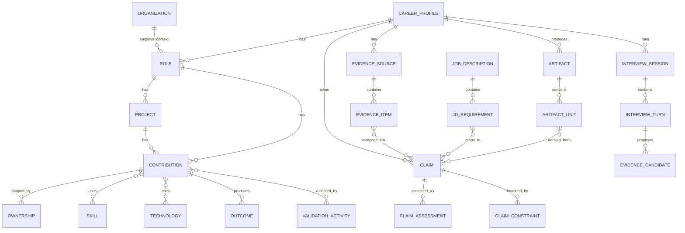

# CareerGround Career Graph — Entity / Relationship Model v1

- **Document status:** Proposed v1 baseline
- **Project:** CareerGround
- **Date:** 2026-09-21
- **Scope:** Career Core canonical conceptual model
- **Primary consumers:** CareerGround Profile, CareerGround Core, CareerGround Live

## 1. Purpose

Career Graph v1 defines the canonical model used by CareerGround to represent a user's career history as evidence-backed, traceable claims.

The model MUST support:

1. Career Claim → Evidence traceability.
2. Explicit Ownership / Contribution boundaries.
3. Separation of user-confirmed, user-claimed, inferred, unknown, contradicted, and do-not-claim states.
4. Resume bullet → Claim → Evidence reverse traceability.
5. JD Requirement → Career Claim mapping.
6. Interview-discovered information as an Evidence Candidate, not an immediate graph mutation.
7. One shared Career Core for the ChatGPT Plugin and Voice Interview App.
8. Reproducible profile snapshots and artifact provenance.

## 2. Design principles

### 2.1 Claim is the atomic truth unit

A `Claim` is the smallest career proposition that CareerGround can validate, reuse, restrict, map, or publish.

Examples:

- Implemented target-speed generation logic for NACC.
- Participated in dataset definition for the DL trajectory-generation project.
- Performed SIL validation for a feature.
- Performed vehicle validation for a feature.
- Did not own the TCN model-selection decision.

A resume bullet may contain multiple Claims and MUST NOT be treated as one indivisible truth unit.

### 2.2 Evidence is distinct from Claim

A Claim is a proposition. Evidence is provenance that supports, contradicts, qualifies, or contextualizes that proposition.

```text
Claim C-101
  "Implemented NACC target-speed logic"

Evidence E-221
  Profiling Session #14, turn 37

Evidence E-222
  Existing resume, Mando section, bullet 3

E-221 SUPPORTS C-101
E-222 SUPPORTS C-101
```

### 2.3 Claim state is multi-axis

CareerGround MUST NOT mix epistemic state and publication policy into one enum.

```text
knowledge_status
  EXTERNALLY_VERIFIED
  USER_CONFIRMED
  USER_CLAIMED
  INFERRED
  UNKNOWN

consistency_status
  CONSISTENT
  CONTRADICTED
  DISPUTED
  NOT_EVALUATED

usage_policy
  ALLOWED
  REVIEW_REQUIRED
  DO_NOT_CLAIM
```

This allows the system to represent, for example, a true statement that is still restricted from use, or an inferred statement that requires confirmation.

### 2.4 Do-not-claim is negative knowledge

`DO_NOT_CLAIM` is modeled through `ClaimConstraint` plus `ClaimAssessment.usage_policy`.

Examples:

```text
Project: DL Trajectory Generation

Allowed
- Dataset definition participation
- Input/output definition participation
- Model analysis support
- System architecture contribution

Blocked
- TCN model-selection ownership
- Overall project ownership
```

### 2.5 Ownership is scoped, not binary

Ownership has both a level and a scope.

```text
ownership_level
  OWNER
  CO_OWNER
  DIRECT_CONTRIBUTOR
  SUPPORTING_CONTRIBUTOR
  REVIEWER
  OBSERVER
  UNKNOWN

scope_type
  PROJECT
  SYSTEM
  SUBSYSTEM
  FEATURE
  MODULE
  TASK
  DECISION
  VALIDATION
  DELIVERABLE
```

Decision authority is modeled separately:

```text
DECIDER
CO_DECIDER
RECOMMENDER
CONTRIBUTOR
INFORMED_ONLY
NONE
UNKNOWN
```

"Implemented" or "worked on" does not imply decision ownership.

### 2.6 Interview discovery is staged

A new statement from a mock interview never mutates the canonical Career Graph immediately.

```text
Interview Turn
  ↓
Evidence Candidate
  ↓
User Review / Additional Profiling
  ↓
Accepted Candidate
  ↓
Evidence Item + Claim/Claim update
  ↓
New Profile Version
```

### 2.7 Outputs are derived artifacts

Resume bullets, cover letters, interview plans, and signed interview packages are derived artifacts. Generated text is never promoted to source truth merely because CareerGround produced it.

## 3. Model layers

```text
6. Artifact / Application Layer
   Resume, ArtifactUnit, JD, JDRequirement,
   InterviewPlan, InterviewSession, InterviewPackage

5. Trace / Mapping Layer
   ArtifactClaimLink, RequirementClaimMap, EvidenceClaimLink

4. Claim Governance Layer
   Claim, ClaimAssessment, ClaimConstraint, ClaimReview

3. Evidence Layer
   EvidenceSource, EvidenceItem, EvidenceCandidate

2. Career Semantics Layer
   Responsibility, Contribution, Ownership, Outcome,
   ValidationActivity, Skill, Technology

1. Career Context Layer
   CareerProfile, Organization, Role, Project
```

## 4. Core entities

### 4.1 CareerProfile

User-owned canonical career model.

Key fields:

```text
profile_id
user_id
current_version
status
created_at
updated_at
```

### 4.2 Organization

Company, institution, laboratory, school, or other organization connected to a Role.

### 4.3 Role

Employment, academic, research, volunteer, or project role.

Key relations:

```text
CareerProfile HAS_ROLE Role
Role AT Organization
Role HAS_PROJECT Project
Role HAS_RESPONSIBILITY Responsibility
Role HAS_CONTRIBUTION Contribution
```

### 4.4 Project

Bounded body of work within a Role.

```text
Role HAS_PROJECT Project
Project HAS_RESPONSIBILITY Responsibility
Project HAS_CONTRIBUTION Contribution
Project HAS_OUTCOME Outcome
Project HAS_VALIDATION ValidationActivity
Project USES Skill
Project USES Technology
```

### 4.5 Responsibility

What the person was assigned, expected, or accountable to handle.

Responsibility is intentionally distinct from Contribution.

```text
Responsibility:
  Own NACC feature specification and release readiness.

Contribution:
  Implemented target-speed selection logic.
```

### 4.6 Contribution

Work actually performed.

Recommended types:

```text
DESIGN
IMPLEMENTATION
INTEGRATION
VALIDATION
ANALYSIS
CALIBRATION
DOCUMENTATION
PROCESS
LEADERSHIP
SUPPORT
REVIEW
OTHER
```

### 4.7 Ownership

Exact boundary of responsibility and authority for a Project, Responsibility, Contribution, or Decision.

Key fields:

```text
ownership_level
scope_type
scope_description
decision_authority
execution_responsibility
validation_responsibility
team_context
```

### 4.8 Skill

Reusable capability concept such as Longitudinal Control, Requirements Engineering, System Architecture, or Verification & Validation.

### 4.9 Technology

Concrete language, tool, protocol, framework, platform, or environment such as C++, MATLAB/Simulink, ROS, CAN-FD, or NVIDIA Thor.

### 4.10 ValidationActivity

Career activity describing verification/validation work, such as SIL regression, HIL validation, vehicle test, log replay, or unit test.

This is distinct from Evidence: a SIL test may prove software behavior, while a profiling transcript may be the evidence that the user performed that SIL test.

### 4.11 Outcome

Result, impact, deliverable, or measurable consequence.

Metrics must carry an explicit status such as `CONFIRMED`, `UNCONFIRMED`, or `NOT_APPLICABLE`.

## 5. Claim governance entities

### 5.1 Claim

Atomic proposition.

Recommended claim types:

```text
RESPONSIBILITY
CONTRIBUTION
OWNERSHIP
SKILL
TECHNOLOGY
VALIDATION
OUTCOME
METRIC
ROLE_SCOPE
PROJECT_SCOPE
OTHER
```

A positive proposition may still exist when blocked by a do-not-claim constraint so that overclaiming can be machine-detected.

### 5.2 ClaimAssessment

Stores current/historical interpretation of a Claim:

```text
knowledge_status
consistency_status
usage_policy
confidence
rationale
assessed_by
assessed_at
profile_version
```

Machine confidence is optional and never replaces explicit status.

### 5.3 ClaimConstraint

Represents a claim boundary.

Recommended types:

```text
DO_NOT_CLAIM
MAX_OWNERSHIP_SCOPE
NO_DECISION_OWNERSHIP
UNVERIFIED_METRIC
WORDING_RESTRICTION
CONFIDENTIALITY_BOUNDARY
REQUIRES_USER_CONFIRMATION
```

A constraint may target a Claim or a broader Project / Contribution / Ownership scope and may have its own evidence.

### 5.4 ClaimReview

Explicit review event:

```text
USER_ACCEPTED
USER_REJECTED
USER_EDITED
NEEDS_FOLLOWUP
SYSTEM_FLAGGED
```

## 6. Evidence model

### 6.1 EvidenceSource

Provenance container.

Recommended source types:

```text
PROFILE_CONVERSATION
USER_DOCUMENT
RESUME
PORTFOLIO
CERTIFICATE
INTERVIEW_TRANSCRIPT
VOICE_RECORDING
EXTERNAL_RECORD
MANUAL_ENTRY
SYSTEM_GENERATED
```

System-generated content is not automatically independent evidence.

### 6.2 EvidenceItem

Smallest traceable segment or record within an EvidenceSource.

Locator examples:

```text
PDF page 2, bullet 4
Profiling session #14, turn 37
Interview #7, 18:32-18:48
Git commit SHA / path / line range
```

### 6.3 EvidenceClaimLink

Many-to-many relation between EvidenceItem and Claim.

```text
SUPPORTS
CONTRADICTS
QUALIFIES
CONTEXTUALIZES
```

### 6.4 EvidenceCandidate

Unverified information discovered during interview/profiling.

Lifecycle:

```text
PENDING
NEEDS_FOLLOWUP
ACCEPTED
REJECTED
DUPLICATE
```

PENDING and NEEDS_FOLLOWUP candidates MUST NOT participate in verified resume generation or signed interview packages.

Promotion:

```text
ACCEPTED EvidenceCandidate
  → create/attach EvidenceItem
  → create/update Claim
  → create EvidenceClaimLink
  → append ClaimAssessment
  → create ClaimReview
  → increment CareerProfile version
```

The candidate remains in history after promotion.

## 7. Artifact traceability model

### 7.1 Artifact

Derived or imported output.

```text
RESUME
COVER_LETTER
INTERVIEW_PLAN
INTERVIEW_PACKAGE
PROFILE_EXPORT
JD_ANALYSIS
OTHER
```

### 7.2 ArtifactUnit

Smallest independently traceable artifact component.

Examples:

```text
Resume bullet
Resume summary sentence
Cover-letter sentence
Interview question seed
Interview answer guidance
```

### 7.3 ArtifactClaimLink

Maps an ArtifactUnit to one or more Claims.

```text
Resume Bullet RB-12
  ├─ DERIVED_FROM Claim C-101
  ├─ DERIVED_FROM Claim C-102
  └─ BOUNDED_BY Constraint K-04
```

This provides both:

```text
Resume bullet → Claim → Evidence
```

and

```text
Evidence → Claim → all artifact units that used it
```

## 8. JD model

### 8.1 JobDescription

Target job description plus provenance.

### 8.2 JDRequirement

Atomic requirement extracted from a JD.

Recommended types:

```text
REQUIRED_SKILL
PREFERRED_SKILL
EXPERIENCE
RESPONSIBILITY
EDUCATION
DOMAIN
TOOL
BEHAVIORAL
OTHER
```

### 8.3 RequirementClaimMap

Maps JD requirements to Career Claims.

```text
mapping_type:
  DIRECT
  SEMANTIC
  TRANSFERABLE
  CONTRADICTORY

coverage_level:
  STRONG
  PARTIAL
  WEAK
  NONE
  NEEDS_PROFILING
```

A mapping is not Evidence. The Claim must independently resolve to Evidence.

## 9. Interview model

### 9.1 InterviewPlan

Derived artifact containing question seeds, expected depth, related JD requirements, related Claims, and risk boundaries.

Questions are seeds, not a fixed script.

### 9.2 InterviewSession

One mock-interview run. It MUST reference the exact profile version used when the session started.

### 9.3 InterviewTurn

One interviewer or candidate utterance. A candidate turn may generate zero or more EvidenceCandidates.

## 10. Versioning and audit

Every accepted change to canonical career truth increments `profile_version`.

Version-changing actions include:

- user confirms/rejects a Claim;
- Evidence Candidate promotion;
- Ownership boundary edits;
- Do-not-claim constraint changes;
- contradiction resolution.

JD analysis and other read-only operations do not increment the profile version.

Canonical data should preserve append-oriented history rather than destructively overwrite important state.

## 11. Relationship catalog

| From | Relationship | To | Cardinality |
|---|---|---|---|
| CareerProfile | HAS_ROLE | Role | 1:N |
| Role | AT | Organization | N:1 |
| Role | HAS_PROJECT | Project | 1:N |
| Role/Project | HAS_RESPONSIBILITY | Responsibility | 1:N |
| Role/Project | HAS_CONTRIBUTION | Contribution | 1:N |
| Contribution | HAS_OWNERSHIP | Ownership | 1:N |
| Contribution | USES | Skill | N:M |
| Contribution | USES | Technology | N:M |
| Contribution | PRODUCES | Outcome | 1:N |
| Contribution | VALIDATED_BY | ValidationActivity | N:M |
| Claim | DESCRIBES | Career entity | N:M |
| EvidenceItem | SUPPORTS/CONTRADICTS/QUALIFIES/CONTEXTUALIZES | Claim | N:M |
| ClaimConstraint | BOUNDS | Claim/Career entity | N:M |
| Artifact | HAS_UNIT | ArtifactUnit | 1:N |
| ArtifactUnit | DERIVED_FROM | Claim | N:M |
| JD | HAS_REQUIREMENT | JDRequirement | 1:N |
| JDRequirement | MATCHES | Claim | N:M |
| InterviewSession | HAS_TURN | InterviewTurn | 1:N |
| InterviewTurn | PROPOSES | EvidenceCandidate | 1:N |
| EvidenceCandidate | PROMOTES_TO | EvidenceItem/Claim | 0:N |

## 12. Mermaid overview



## 13. Required traceability paths

### Resume → Evidence

```text
Artifact(Resume)
  → ArtifactUnit(ResumeBullet)
  → ArtifactClaimLink
  → Claim
  → EvidenceClaimLink
  → EvidenceItem
  → EvidenceSource
```

### JD → Evidence

```text
JobDescription
  → JDRequirement
  → RequirementClaimMap
  → Claim
  → EvidenceClaimLink
  → EvidenceItem
```

### Interview new information → Career Graph

```text
InterviewSession
  → InterviewTurn
  → EvidenceCandidate(PENDING)
  → Human review / profiling
  → EvidenceCandidate(ACCEPTED)
  → EvidenceItem + Claim/Assessment
  → ProfileVersion N+1
```

No shortcut from InterviewTurn to canonical Claim is allowed in v1.

## 14. Claim publication gate

Before a Claim may be used in a verified resume or signed interview package:

```text
1. usage_policy == ALLOWED
2. consistency_status == CONSISTENT
3. knowledge_status is acceptable for artifact policy
4. eligible EvidenceClaimLink exists
5. wording is compatible with ownership boundary
6. required user confirmation exists for high-impact ownership/metric claims
```

Suggested default:

| State | Verified resume | Draft | Voice probing |
|---|---:|---:|---:|
| EXTERNALLY_VERIFIED | Yes | Yes | Yes |
| USER_CONFIRMED | Yes | Yes | Yes |
| USER_CLAIMED | Review required | Yes | Yes |
| INFERRED | No | Suggestion only | Yes |
| UNKNOWN | No | No | Yes |
| CONTRADICTED | No | No | Clarification only |
| DO_NOT_CLAIM | No | No | Boundary guard only |

## 15. Example: DL Trajectory Generation

```text
Project
  DL Trajectory Generation

Contributions
  Participated in dataset definition
  Participated in input/output definition
  Supported model analysis
  Contributed to system architecture after model selection

Ownership
  level = SUPPORTING_CONTRIBUTOR
  scope_type = TASK
  scope_description = Model analysis support only
  decision_authority = CONTRIBUTOR

Allowed atomic Claims
  "Contributed to dataset definition for DL trajectory generation."
  "Contributed to I/O definition for DL trajectory generation."

Constraint
  type = NO_DECISION_OWNERSHIP
  "Do not claim ownership of the TCN selection decision."
```

## 16. v1 decisions

```text
DECISION-01  Claim is the atomic factual unit.
DECISION-02  EvidenceSource and EvidenceItem are separated.
DECISION-03  Claim state is multi-axis: knowledge / consistency / usage.
DECISION-04  Do-not-claim is ClaimConstraint + usage policy.
DECISION-05  Responsibility and Contribution remain separate.
DECISION-06  Ownership is scoped, not a boolean or verb inference.
DECISION-07  Resume/JD/Interview outputs are derived Artifacts.
DECISION-08  ResumeBullet → Claim is explicit many-to-many mapping.
DECISION-09  JDRequirement → Claim is explicit many-to-many mapping.
DECISION-10  Interview discoveries enter as EvidenceCandidate only.
DECISION-11  Canonical changes create a new CareerProfile version.
DECISION-12  PostgreSQL can implement v1; a graph DB is not required.
```

## 17. Acceptance criteria

The model is acceptable only if CareerGround can answer deterministically:

1. Why is this resume sentence allowed?
2. Which atomic Claims does it contain?
3. What Evidence supports each Claim?
4. What is the user's ownership boundary?
5. Is any stronger wording explicitly prohibited?
6. Which JD requirement does this Claim address?
7. Which profile version generated the artifact?
8. Was interview-discovered information verified before becoming canonical?
9. Can contradictions be represented without deleting either source?
10. Can Profile and Live consume the same canonical model?

## 18. Next document

Physical/logical storage is defined in:

`docs/career_graph_schema_v1.md`


## 19. Validation clarifications

[Schema §28](career_graph_schema_v1.md#28-fixture-validation-clarifications) defines
the validated interchange, explicit review, promotion and snapshot rules. ClaimReview
and ArtifactConstraintLink must be retained for these governance paths, even in MVP.

OWNER does not imply decision authority. Use UNKNOWN until supplied. Team/process
leadership uses a precise TASK/VALIDATION scope and never implies product implementation.
A scoped constraint limits its stated proposition, not every fact in the project.

Publication requires CONSISTENT + ALLOWED, eligible SUPPORTS evidence and explicit user
review of the atomic wording/scope. Other evidence relations or SYSTEM_GENERATED text
alone do not establish support. Knowledge-status table entries in §14 are conditional
on these gates. External verification requires a separate policy and is not implied
by user confirmation. Refer to Profiling Protocol §5 for high-impact review categories.

PENDING/follow-up/rejected/duplicate candidates do not change canonical state. Explicit
approval creates the assessment/review with the other promoted rows in one version
change. ACCEPTED replay is idempotent. Accepting conflicting evidence preserves sources
and constraints, records a reviewed conflict and blocks publication; pending conflicts
remain in the workspace. Resolving them requires separate explicit review.

Complete immutable version-keyed snapshots retain the context, evidence and boundaries
used by old artifacts. Missing archive data fails resolution rather than using latest.
This supplements append-oriented history without adding a new domain entity.
